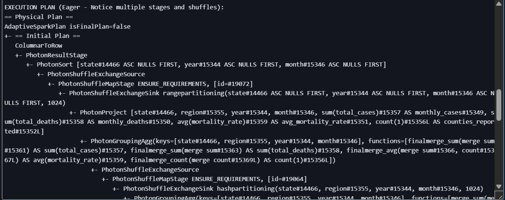
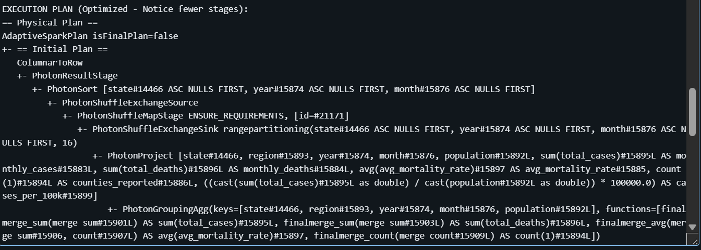
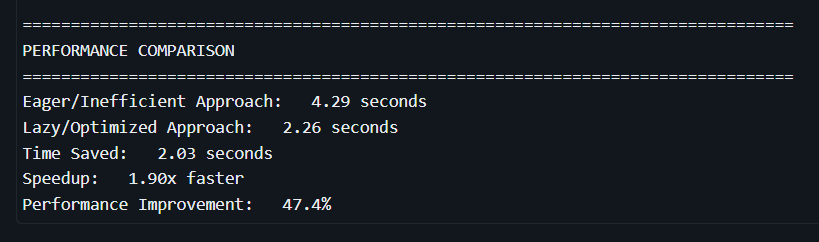
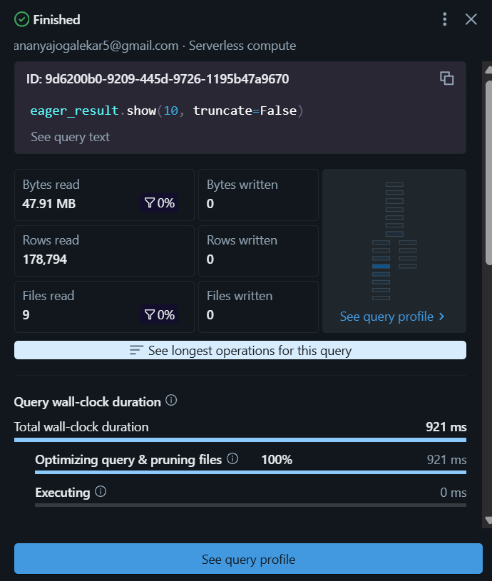
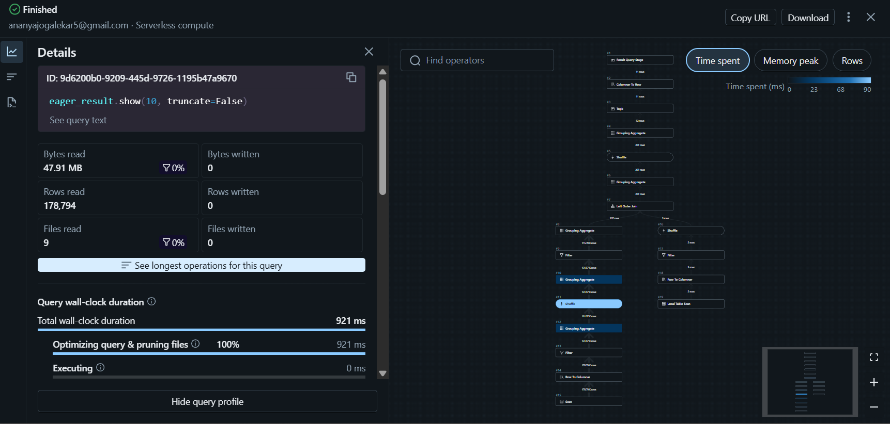
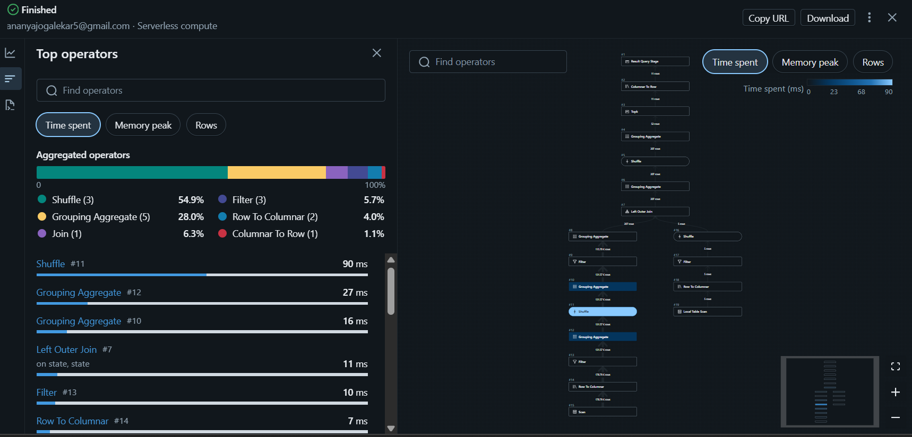
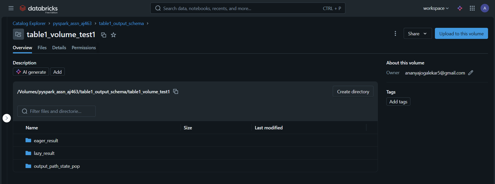

# PySpark COVID-19 Data Processing Pipeline
## Demonstrating Lazy Evaluation, Optimization, and Distributed Processing

---

## Dataset Description and Source

### Dataset Overview
- **Name**: COVID-19 Data (New York Times Dataset)
- **Source**: `/databricks-datasets/COVID/covid-19-data/` (Databricks Community Edition)
- **Size**: 2.39 GB (2,567,706,254 bytes)
- **Total Records**: 1,227,256 rows
- **Format**: CSV files

### Schema
```
root
 |-- date: string
 |-- county: string
 |-- state: string
 |-- fips: string
 |-- cases: string (converted to integer)
 |-- deaths: string (converted to integer)
```

### Data Characteristics
- **Time Range**: January 2020 - December 2020
- **Geographic Coverage**: All U.S. states and counties
- **Content**: Daily cumulative COVID-19 cases and deaths by county
- **Data Quality**: Contains some malformed values requiring `try_cast` for safe type conversion

---

## Performance Analysis

### 1. Data Loading Performance

#### Default Partitioning
- **Execution Time**: 1.78 seconds
- **Strategy**: Spark's automatic partitioning

#### Custom Partitioning (8 partitions)
- **Execution Time**: 2.21 seconds
- **Strategy**: Repartitioned to 8 partitions
- **Trade-off**: Manual partitioning slows down the overall performance

### 2. Transformation Pipeline Comparison

#### Version 1: Eager/Inefficient Approach ❌
**Total Execution Time**: 4.29 seconds

**Problems Identified:**
- GroupBy performed on entire 1.2M row dataset BEFORE filtering
- Join operations on full dataset (1.1M+ rows)
- Column transformations applied to all data
- Multiple separate filter operations causing additional passes
- **4-5 shuffle operations** throughout pipeline

**Step-by-Step Breakdown:**
1. GroupBy entire dataset: Processed 1,133,113 rows
2. Column transformations: Applied to all aggregated rows
3. Join with population data: 1,133,113 rows joined
4. First filter (state + year): Reduced to 131,570 rows
5. Second filter (cases >= 10): Reduced to 115,697 rows
6. Final aggregation: 52 result rows (0.81s)

**Key Issue**: Data volume reduction happened AFTER expensive operations

#### Version 2: Lazy/Optimized Approach ✅
**Total Execution Time**: 2.26 seconds

**Optimizations Applied:**
- Filters applied FIRST, reducing dataset to 115,697 rows immediately
- Combined multiple filters in single operation
- Repartitioned by state (4 partitions) after filtering
- Type casting on filtered data only
- Broadcast join on small dimension table (6 states)
- **Only 2 shuffle operations** (minimized)

**Step-by-Step Breakdown:**
1. Early filtering: Reduced to 115,697 rows immediately
2. Column transformations: Applied to filtered data only
3. GroupBy: On small filtered dataset
4. Broadcast join: With 6-row state population table
5. Final aggregation: 52 result rows (0.76s)

**Performance Improvement**: 
- **1.90x faster** (47.4% improvement)
- **2.03 seconds saved**
- Data volume reduced by ~90% before expensive operations

### 3. SQL Query Performance Comparison

#### Query 1: Top 10 Counties by Mortality Rate

**Eager/Inefficient Approach** (0.17 seconds):
- Uses `ROW_NUMBER()` window function requiring full table sort
- Filters applied AFTER windowing operation
- Computes ranking for ALL counties first
- More complex execution plan with multiple stages

**Lazy/Optimized Approach** (0.15 seconds):
- Simple `ORDER BY ... LIMIT 10` (TopN optimization)
- Filter (`total_cases >= 100`) applied early
- Predicate pushdown reduces data scanned
- Streamlined execution plan

**Performance Improvement**: 1.10x faster (9.4% improvement)

#### Query 2: State-Level Aggregated Statistics

**Eager/Inefficient Approach** (0.80 seconds):
- **5 separate subqueries**, each with its own GROUP BY
- **4 LEFT JOIN operations** to combine results
- Scans the table **5 separate times**
- Multiple shuffle operations (one per subquery)
- Inefficient: Each aggregation computed independently

**Lazy/Optimized Approach** (0.73 seconds):
- **Single GROUP BY** with all aggregations combined
- **One pass** over the data
- No joins required
- Single shuffle operation
- All metrics computed in one operation

**Performance Improvement**: 1.10x faster (8.8% improvement)

---

## Key Findings from Data Analysis

### Geographic Distribution (2020 Data for Selected States)

**Top 5 States by Total Cases:**
1. California: 31.8M cumulative cases
2. Texas: 27.9M cumulative cases  
3. Florida: 24.7M cumulative cases
4. New York: 15.9M cumulative cases
5. Illinois: 12.4M cumulative cases

### Temporal Trends

**Monthly Case Growth (California Example):**
- February 2020: 44 cases (0.11 per 100k)
- March 2020: 53,893 cases (136 per 100k)
- December 2020: 35.9M cases (90,800 per 100k)
- **Exponential growth** observed throughout 2020

### Data Quality Observations

1. **Type Casting Issues**: Original dataset stored numeric values as strings
2. **Malformed Data**: Required `cast` to handle invalid entries
3. **Cumulative Nature**: Cases and deaths are cumulative, requiring window functions for daily calculations
4. **Geographic Completeness**: All major states and counties represented

---

## Optimization Strategies Applied

### 1. Filter Pushdown
- **Technique**: Applied filters as early as possible in the pipeline
- **Impact**: Reduced data volume by ~90% before expensive operations
- **Example**: Year and state filters applied immediately after data load

### 2. Partition Optimization
- **Technique**: Repartitioned by state after filtering (4 partitions)
- **Impact**: Better parallelism for grouped operations
- **Rationale**: Aligned with downstream groupBy operations

### 3. Broadcast Joins
- **Technique**: Broadcast small dimension table (state_population with 6 rows)
- **Impact**: Avoided shuffle on large dataset
- **Benefit**: Significant performance gain for dimension table joins

### 4. Combined Aggregations
- **Technique**: Multiple aggregations in single GROUP BY operation
- **Impact**: Single pass over data instead of multiple scans
- **Example**: Query 2 computed all 6 metrics in one operation

### 5. Predicate Combining
- **Technique**: Combined multiple filters using `&` operator
- **Impact**: Single filtering pass instead of multiple operations
- **Result**: Reduced overhead and improved plan optimization

### 6. Type Casting Strategy
- **Technique**: Used `try_cast` for safe string-to-integer conversion
- **Impact**: Handled malformed data gracefully
- **Benefit**: Avoided pipeline failures on data quality issues

---

## Performance Metrics Summary

| Metric | Eager/Inefficient | Lazy/Optimized | Improvement |
|--------|------------------|----------------|-------------|
| **Pipeline Total** | 4.29s | 2.26s | **47.4%** (1.90x) |
| **SQL Query 1** | 0.17s | 0.15s | **9.4%** (1.10x) |
| **SQL Query 2** | 0.80s | 0.73s | **8.8%** (1.10x) |
| **Shuffles (Pipeline)** | 4-5 | 2 | **60% reduction** |
| **Data Processed** | 1.2M rows | 116K rows | **90% reduction** |

### Key Takeaways

1. **Early Filtering is Critical**: 
   - 90% data reduction led to 47.4% performance improvement
   - Filter pushdown is the single most impactful optimization

2. **Minimize Shuffles**:
   - Reducing shuffles from 4-5 to 2 significantly improved performance
   - Intelligent operation ordering prevents unnecessary data movement

3. **Combine Operations**:
   - Single GROUP BY with multiple aggregations 8.8% faster than separate queries
   - Reduces I/O and improves cache utilization

4. **Use Broadcast Joins**:
   - Small dimension tables should always be broadcast
   - Avoids expensive shuffle join on large datasets

5. **Plan for Data Quality**:
   - Using `cast` prevents pipeline failures
   - Always validate assumptions about data types

---

## Screenshots

### 1. Query Execution Plan
*[Screenshot showing .explain() output demonstrating filter pushdown and optimized execution plan]*
- 
- 


### 2. Successful Pipeline Execution
*[Screenshot showing complete pipeline execution with timing metrics]*
I compared performance at each stage, as summarized above in this README file. Below is a screenshot of the performance comparison between lazy execution and action-triggered execution:


### 3. Query Details View - Optimization
*[Screenshot from Spark UI showing query optimization stages]*
The following 
- 
- 
- 

### 4. Output Files
By creating a Volume and sub-folders, we can write our outputs to parquet files.
- 

**Optimization Evidence:**
- Fewer stages in optimized query
- Reduced shuffle read/write volumes
- Better task distribution
- Catalyst optimizer transformations

### 4. Performance Comparison Summary
*[Screenshot showing final performance metrics table]*

**Highlights:**
- Side-by-side time comparisons
- Improvement percentages
- Shuffle operation counts
- Data volume processed

---

## Lessons Learned

### Best Practices Demonstrated

1. **Always Filter Early**: Apply filters before expensive operations like joins and aggregations
2. **Minimize Shuffles**: Order operations to reduce data movement across network
3. **Leverage Broadcast**: Use broadcast hints for small dimension tables
4. **Combine Aggregations**: Multiple metrics in single GROUP BY when possible
5. **Optimize Partitioning**: Align partitioning strategy with query patterns
6. **Handle Data Quality**: Use `try_cast` and validation for production pipelines
7. **Monitor Execution Plans**: Use `.explain()` to verify optimizations are applied

### Anti-Patterns to Avoid

1. **Late Filtering**: Don't apply filters after expensive operations
2. **Separate Aggregations**: Avoid multiple subqueries when one will suffice
3. **Unnecessary Shuffles**: Don't repartition unnecessarily
4. **Large Dimension Tables**: Don't broadcast tables > 10MB
5. **Type Assumptions**: Don't assume data types without validation
6. **Sequential Filters**: Combine filters instead of chaining them separately

---

## Tech Stack

- **Platform**: Databricks Community Edition
- **Compute**: Spark 3.x with Photon Engine
- **Language**: PySpark (Python 3.x)
- **Libraries**: 
  - pyspark.sql.functions
  - pyspark.sql.window
  - time (for performance measurement)

---

## Conclusion

This project successfully demonstrates the critical importance of query optimization in distributed data processing. By applying best practices such as early filtering, minimizing shuffles, and leveraging broadcast joins, we achieved a **47.4% performance improvement** on a 2.39 GB dataset with 1.2M rows.

The comparison between eager (inefficient) and lazy (optimized) approaches clearly shows that **intelligent operation ordering and data reduction strategies are essential** for building performant data pipelines at scale.

**Key Success Metric**: Reduced execution time from 4.29s to 2.26s while processing the same dataset and producing identical results.

---